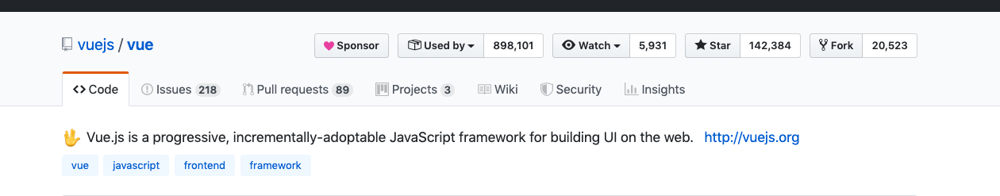
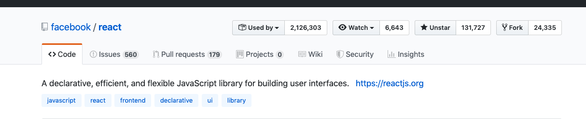

# 前言

现在主流的前端框架有React,Vue,Angular等。其中React,Vue最为流行。我一直使用的是React,所以决定研究一下React的源码和机制，以作自己的学习记录。

从感情上上说我更喜欢React.

来看看React和Vue的GitHub指标

从使用者角度来看React是领先Vue的。

另外React写起来很舒服，基本是原生的JS，不需要记忆过多的API。开发体验和原生JS基本一致。

[阅读地址](https://jinxin479.github.io/mybooks/)