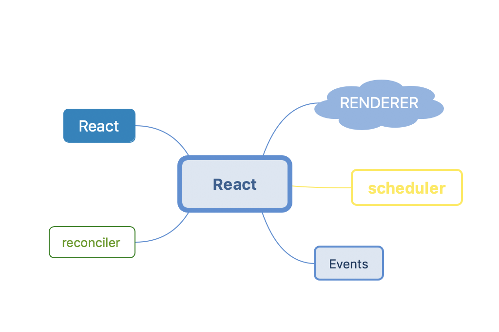

## React项目结构



但从React 构建后的文件来看可以分为react 和 react-dom这两个文件。

从React项目的源码组织结构来看React可以分为五大模块

- React
- Reconciler
- Scheduler
- Renderer
- Events
  


React.js这个包主要包含定义React组件所需的功能,它通常与React渲染器一起使用，例如用于web的react-dom，或者用于native环境的react-native.

#### React

React Component API:提供组件的API和生命周期，hooks的API等。
```
var React = {
  Children: {
    map: mapChildren,
    forEach: forEachChildren,
    count: countChildren,
    toArray: toArray,
    only: onlyChild
  },

  createRef: createRef,
  Component: Component,
  PureComponent: PureComponent,

  createContext: createContext,
  forwardRef: forwardRef,
  lazy: lazy,
  memo: memo,

  useCallback: useCallback,
  useContext: useContext,
  useEffect: useEffect,
  useImperativeHandle: useImperativeHandle,
  useDebugValue: useDebugValue,
  useLayoutEffect: useLayoutEffect,
  useMemo: useMemo,
  useReducer: useReducer,
  useRef: useRef,
  useState: useState,

  Fragment: REACT_FRAGMENT_TYPE,
  StrictMode: REACT_STRICT_MODE_TYPE,
  Suspense: REACT_SUSPENSE_TYPE,

  createElement: createElementWithValidation,
  cloneElement: cloneElementWithValidation,
  createFactory: createFactoryWithValidation,
  isValidElement: isValidElement,

  version: ReactVersion,

  unstable_ConcurrentMode: REACT_CONCURRENT_MODE_TYPE,
  unstable_Profiler: REACT_PROFILER_TYPE,

  __SECRET_INTERNALS_DO_NOT_USE_OR_YOU_WILL_BE_FIRED: ReactSharedInternals
};
```

  #### React Reconciler
  React diff算法的核心，计算变化且应用变化到目标上,比如Fiber Reconciler

####  React Scheduler

这是用于在浏览器环境中进行协作调度的包。它目前由React内部使用


####  React Renderer
  React-reconciler所需的一些功能的实现,react-reconciler 将根据需要调用这些函数来应用更新到目标上。不同平台Renderer实现不同，
  有react-dom,react-art,react-test-renderer,react-native-renderer

  React的设计使得Reconciliation和renderer是分开的阶段,所以React可以支持不同的目标平台，如DOM,native等 Reconcilation责计算树的哪些部分改变了，renderer使用该信息对应用程序进行实际上的更新渲染。reconciler其实是不同的平台共享的。

  

#### React Events
为了跨浏览器兼容和提高事件的性能，React 根据 W3C 规范来定义合成事件，拥有和浏览器原生事件相同的接口。


React项目的package目录


