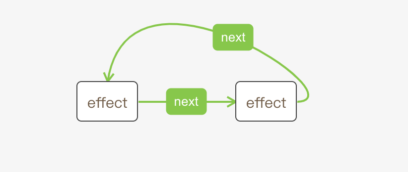

## Hooks


### hooks类型
目前React 16.7共有以下几种hooks,但是useEvent还未公开使用
```
export type HookType =
  | 'useState'
  | 'useReducer'
  | 'useContext'
  | 'useRef'
  | 'useEffect'
  | 'useLayoutEffect'
  | 'useCallback'
  | 'useMemo'
  | 'useImperativeHandle'
  | 'useDebugValue'
  | 'useEvent';
```

### hooks中的基本数据结构

- Update
- UpdateQueue
- Effect
- Hook
- 其他控制变量


#### 1. Update
```
type Update<S, A> = {
  expirationTime: ExpirationTime,//过期时间
  suspenseConfig: null | SuspenseConfig,
  action: A,//修改动作
  eagerReducer: ((S, A) => S) | null,//下一个reducer
  eagerState: S | null,//下一次的state
  next: Update<S, A> | null,//下一个update
};
```

#### 2. UpdateQueue
更新队列
```
type UpdateQueue<S, A> = {
  last: Update<S, A> | null,
  dispatch: (A => mixed) | null,
  lastRenderedReducer: ((S, A) => S) | null,
  lastRenderedState: S | null,
};
```

#### 3. Effect
effect是一个循环链表结构
```
type Effect = {
  tag: HookEffectTag,
  create: () => (() => void) | void,//useEffect第一个参数
  destroy: (() => void) | void,//useEffect返回的取消函数
  deps: Array<mixed> | null,//依赖项
  next: Effect,
};
```


#### 4. hook

```
export type Hook = {
  memoizedState: any,//上一次的state

  baseState: any,//当前state
  baseUpdate: Update<any, any> | null,// update func
  queue: UpdateQueue<any, any> | null,//用于缓存多次action

  next: Hook | null,//下一个hook
};
```
;

在代码中hook是一个单链表，react维护两个hook相关到链表，一个是current hook list属于current fiber的，指针为currentHook和nextCurrentHook；一个是work-in-progress hook list，该list是属于work-in-progress fiber的，指针为firstWorkInProgressHook、workInProgressHook和nextWorkInProgressHook。

*** hook会保存到fiber的memoizedState属性上 ***

```
let currentHook = null; // 指向current fiber中当前的hook
let nextCurrentHook = null; // 指向current fiber中下一个hook
let firstWorkInProgressHook = null; // 指向work-in-progress fiber第一个hook
let workInProgressHook = null; // 指向work-in-progress fiber当前hook
let nextWorkInProgressHook = null; // 指向work-in-progress fiber下一个hook
```

react还维护着两个与hook类型有关的列表，列表确保在每次渲染的时候都以相同的顺序调用hooks。

```
let hookTypesDev = null; // 存储初始渲染（mount）时hook的顺序
let hookTypesUpdateIndexDev = -1; // 后续渲染（update）时使用
```

#### hook的mount阶段和update阶段

在mount阶段，初始化新的hook，在update阶段，将current fiber的hook克隆到work-in-progress fiber中。

```
function mountWorkInProgressHook(): Hook {
  const hook: Hook = {
    memoizedState: null,

    baseState: null,
    queue: null,
    baseUpdate: null,

    next: null,
  };

  if (workInProgressHook === null) {
    // 如果之前没有list中hook，则是第一个hook
    firstWorkInProgressHook = workInProgressHook = hook;
  } else {
    // 否则，则向链表中增加hook
    workInProgressHook = workInProgressHook.next = hook;
  }
  //返回新增的hook
  return workInProgressHook;
}


function updateWorkInProgressHook(): Hook {
    //这个方法用于更新和render阶段触发的重新渲染
  
  if (nextWorkInProgressHook !== null) {
    // 已经存在 work-in-progress的话就复用它.
    workInProgressHook = nextWorkInProgressHook;
    nextWorkInProgressHook = workInProgressHook.next;

    currentHook = nextCurrentHook;
    nextCurrentHook = currentHook !== null ? currentHook.next : null;
  } else {
    // 从 current hook克隆.
    currentHook = nextCurrentHook;

    const newHook: Hook = {
      memoizedState: currentHook.memoizedState,

      baseState: currentHook.baseState,
      queue: currentHook.queue,
      baseUpdate: currentHook.baseUpdate,

      next: null,
    };

    if (workInProgressHook === null) {
      // This is the first hook in the list.
      workInProgressHook = firstWorkInProgressHook = newHook;
    } else {
      // Append to the end of the list.
      workInProgressHook = workInProgressHook.next = newHook;
    }
    nextCurrentHook = currentHook.next;
  }
  return workInProgressHook;
}


```

在React中hooks的mount阶段和update阶段对应的处理方法很多是不同的，比如

HooksDispatcherOnMount ，HooksDispatcherOnUpdate，这两个方法中useState,useEffect等方法实现不逻辑一样，分别处理mount和update阶段的任务。

会通过nextCurrentHook区分这两个阶段

```
ReactCurrentDispatcher.current =
      nextCurrentHook === null
        ? HooksDispatcherOnMount
        : HooksDispatcherOnUpdate;
```


### hooks的调用过程


hooks是在函数组件中使用的，所以需要关注函数组件的调用过程及使用的方法。

重点关注``` renderWithHooks ``` 方法，renderWithHooks函数就是处理各种hooks逻辑的核心部分

mount过程执行mountIndeterminateComponent，renderWithHooks的第一个参数current=null；


update过程中执行updateFunctionComponent，renderWithHooks的第一个参数current为workInProgress.alternate 

```
renderWithHooks(
  current: Fiber | null, //当前的fiber结点
  workInProgress: Fiber, 
  Component: any, //jsx中用<>调用的函数
  props: any,
  refOrContext: any,
  nextRenderExpirationTime: ExpirationTime, //过期时间
): any

```

renderWithHooks的主要功能是

```
// currentlyRenderingFiber$1指向workInProgress
 currentlyRenderingFiber$1 = workInProgress;

//从memoizedState中取出hooks

nextCurrentHook = current !== null ? current.memoizedState : null; 
//用nextCurrentHook的值来区分mount和update，设置不同的dispatcher

ReactCurrentDispatcher.current =
      nextCurrentHook === null
        ? HooksDispatcherOnMount
        : HooksDispatcherOnUpdate;
//执行传入的type函数,此时已经有了新的dispatcher,在调用Component时就可以拿到新的对象
let children = Component(props, refOrContext);

//重置为ContextOnlyDispatcher
ReactCurrentDispatcher.current = ContextOnlyDispatcher;
// 更新memoizedState和updateQueue
  let renderedWork = currentlyRenderingFiber$1;

  renderedWork.memoizedState = firstWorkInProgressHook;
  renderedWork.expirationTime = remainingExpirationTime;
  renderedWork.updateQueue = componentUpdateQueue;
  renderedWork.effectTag |= sideEffectTag;
  //重置各种变量

  renderExpirationTime = NoWork;
  currentlyRenderingFiber$1 = null;

  currentHook = null;
  nextCurrentHook = null;
  firstWorkInProgressHook = null;
  workInProgressHook = null;
  nextWorkInProgressHook = null;
  remainingExpirationTime = NoWork;
  componentUpdateQueue = null;
  sideEffectTag = 0;

return children;
```

当执行Component(props, refOrContext)的时候就会调用函数组件中的useState等方法处理hooks。

在这个例子中会依次调用hooks方法，并生成一个hooks链表，保存到 当前fiber的memoizedState中，副作用effect会额外保存一份到fiber的updateQueue中，并标记当前fiber的effectTag。

以useState为例说一下大致流程

```
const  Hello =  () => {
  const [count, setCount] = React.useState(0);
  
  const [name, setName] = React.useState("test");
  const onClick = ()=>{
    setCount(1);
    setName('hello world');
  }
  React.useEffect(() => {
    document.title = `You clicked ${count} times`;
    
  },[count]);
  React.useEffect(() => {
    fetch('https://jsonplaceholder.typicode.com/todos/1')
    .then(response => response.json())
    .then(json => console.log(json))
  },[name]);
  return (
    <React.Fragment>
      <div style={{'backgroundColor':'red','height':100}} onClick={onClick}>click me </div>
       <p>我是{name}</p>
    </React.Fragment>
  );
}
```

## hooks初始化

创建一个新的hook，初始化state， 并绑定触发器

初始化阶段ReactCurrentDispatcher.current 会指向HooksDispatcherOnMount 对象


```
const HooksDispatcherOnMount: Dispatcher = {
/** 省略其它Hooks **/
  useState: mountState,
};
```
mountState

```
function mountState<S>(
  initialState: (() => S) | S,
): [S, Dispatch<BasicStateAction<S>>] {

  //创建一个hook,改变workInProgressHook指针指向
  const hook = mountWorkInProgressHook();
  //initialState是函数就调用它
  if (typeof initialState === 'function') {
    initialState = initialState();
  }
  //state初始化
  hook.memoizedState = hook.baseState = initialState;
  //queue初始化
  const queue = (hook.queue = {
    last: null,//最近的一次更新
    dispatch: null,
    lastRenderedReducer: basicStateReducer,// useState使用基础reducer
    lastRenderedState: (initialState: any),
  });
  // 触发器绑定当前fiber和queue
  const dispatch: Dispatch<
    BasicStateAction<S>,
  > = (queue.dispatch = (dispatchAction.bind(
    null,
    ((currentlyRenderingFiber: any): Fiber),
    queue,
  ): any));
  // 返回初始state和触发器
  return [hook.memoizedState, dispatch];
}
```


```
function basicStateReducer<S>(state: S, action: BasicStateAction<S>): S {
  return typeof action === 'function' ? action(state) : action;
}
```


#### dispatchAction


```
function dispatchAction<S, A>(
  fiber: Fiber,
  queue: UpdateQueue<S, A>,
  action: A,
) {


  const alternate = fiber.alternate;
  if (
    fiber === currentlyRenderingFiber ||
    (alternate !== null && alternate === currentlyRenderingFiber)
  ) {
    //这是一个render阶段的update,先保存在一个懒创建的map中，在render阶段结束之后在重启改任务，将其应用在work-in-progress hook上
    
    didScheduleRenderPhaseUpdate = true;
    //创建update
    const update: Update<S, A> = {
      expirationTime: renderExpirationTime,
      suspenseConfig: null,
      action,
      eagerReducer: null,
      eagerState: null,
      next: null,
    };
    if (renderPhaseUpdates === null) {
      renderPhaseUpdates = new Map();
    }
    const firstRenderPhaseUpdate = renderPhaseUpdates.get(queue);
    if (firstRenderPhaseUpdate === undefined) {
      renderPhaseUpdates.set(queue, update);
    } else {
      // Append the update to the end of the list.
      let lastRenderPhaseUpdate = firstRenderPhaseUpdate;
      while (lastRenderPhaseUpdate.next !== null) {
        lastRenderPhaseUpdate = lastRenderPhaseUpdate.next;
      }
      lastRenderPhaseUpdate.next = update;
    }
  } else {
    if (revertPassiveEffectsChange) {
      flushPassiveEffects();
    }

    const currentTime = requestCurrentTime();
    const suspenseConfig = requestCurrentSuspenseConfig();
    const expirationTime = computeExpirationForFiber(
      currentTime,
      fiber,
      suspenseConfig,
    );
  //创建update
    const update: Update<S, A> = {
      expirationTime,
      suspenseConfig,
      action,
      eagerReducer: null,
      eagerState: null,
      next: null,
    };

、    //将update添加到list的末尾
    const last = queue.last;
    if (last === null) {
      //这是第一个update，要创建一个循环链表
      update.next = update;
    } else {
      const first = last.next;
      if (first !== null) {
        // Still circular.
        update.next = first;
      }
      last.next = update;
    }
    //last指向最新的一次update,last.next指向第一次更新
    queue.last = update;

    if (
      fiber.expirationTime === NoWork &&
      (alternate === null || alternate.expirationTime === NoWork)
    ) {
      // queue 是空的，意味着可以在进入render阶段之前就计算下一个state,如果新的state和当前的state相同，可以熔断。
     
      const lastRenderedReducer = queue.lastRenderedReducer;
      if (lastRenderedReducer !== null) {
        let prevDispatcher;
        if (__DEV__) {
          prevDispatcher = ReactCurrentDispatcher.current;
          ReactCurrentDispatcher.current = InvalidNestedHooksDispatcherOnUpdateInDEV;
        }
        try {
          const currentState: S = (queue.lastRenderedState: any);
          const eagerState = lastRenderedReducer(currentState, action);
          //保存计算出来的新state和reducer，如果reducer没有变化，在render阶段就可以使用刚计算出来的state，不需要再次调用reducer
          update.eagerReducer = lastRenderedReducer;
          update.eagerState = eagerState;
          if (is(eagerState, currentState)) {
            // state没有变化，可以熔断，防止重复渲染
            return;
          }
        } catch (error) {
          // Suppress the error. It will throw again in the render phase.
        } finally {
          if (__DEV__) {
            ReactCurrentDispatcher.current = prevDispatcher;
          }
        }
      }
    }
    scheduleWork(fiber, expirationTime);
  }
}
```


## hook 更新


ReactCurrentDispatcher.current 会指向HooksDispatcherOnUpdate 对象

#####  确保hook的顺序问题
  
```
hookTypesUpdateIndexDev 更新阶段初始化为0
function updateHookTypesDev() {
  if (__DEV__) {
    const hookName = ((currentHookNameInDev: any): HookType);

    if (hookTypesDev !== null) {
      hookTypesUpdateIndexDev++;
      if (hookTypesDev[hookTypesUpdateIndexDev] !== hookName) {
        warnOnHookMismatchInDev(hookName);
      }
    }
  }
}
```
##### 调用updateState
  
```
  function updateState(initialState) {
  return updateReducer(basicStateReducer, initialState);
}

function updateReducer<S, I, A>(
  reducer: (S, A) => S,
  initialArg: I,
  init?: I => S,
): [S, Dispatch<A>] {
  //获取当前hook
  const hook = updateWorkInProgressHook();
  const queue = hook.queue;
  invariant(
    queue !== null,
    'Should have a queue. This is likely a bug in React. Please file an issue.',
  );

  queue.lastRenderedReducer = reducer;

  if (numberOfReRenders > 0) {
    //重新render,将新render阶段的update添加到以前的work-in-progress hook
  
    const dispatch: Dispatch<A> = (queue.dispatch: any);
    //此变量在dispatchAction中设置过，调用我们的setCount函数会调用dispatchAction
    if (renderPhaseUpdates !== null) {
      //render阶段的更新被存储在map中，是一个链表
      const firstRenderPhaseUpdate = renderPhaseUpdates.get(queue);
      if (firstRenderPhaseUpdate !== undefined) {
        renderPhaseUpdates.delete(queue);
        let newState = hook.memoizedState;
        let update = firstRenderPhaseUpdate;
        do {
          
          const action = update.action;
          newState = reducer(newState, action);
          update = update.next;
        } while (update !== null);

        // Mark that the fiber performed work, but only if the new state is
        // different from the current state.
        if (!is(newState, hook.memoizedState)) {
          markWorkInProgressReceivedUpdate();
        }

        hook.memoizedState = newState;
        // Don't persist the state accumlated from the render phase updates to
        // the base state unless the queue is empty.
       
        if (hook.baseUpdate === queue.last) {
          hook.baseState = newState;
        }

        queue.lastRenderedState = newState;

        return [newState, dispatch];
      }
    }
    return [hook.memoizedState, dispatch];
  }

  // 整个queue中的最新的update
  const last = queue.last;
  // The last update that is part of the base state.
  const baseUpdate = hook.baseUpdate;
  const baseState = hook.baseState;

  // 找到第一个未处理的update.
  let first;
  if (baseUpdate !== null) {
    if (last !== null) {
      //由于queue是一个循环链表，`queue.last.next = queue.first` 一旦第一个update提交了，baseUpdate就不在是空的，此时不用处理了
      last.next = null;
    }
    first = baseUpdate.next;
  } else {
    first = last !== null ? last.next : null;
  }
  if (first !== null) {
    let newState = baseState;
    let newBaseState = null;
    let newBaseUpdate = null;
    let prevUpdate = baseUpdate;
    let update = first;
    let didSkip = false;
    do {
      const updateExpirationTime = update.expirationTime;
      if (updateExpirationTime < renderExpirationTime) {
        // Priority is insufficient. Skip this update. If this is the first
        // skipped update, the previous update/state is the new base
        // update/state.
        //优先级不够，就跳过此update,如果这是第一个跳过的update,那么以前的update/state,就是新的基本 update/state.
        if (!didSkip) {
          didSkip = true;
          newBaseUpdate = prevUpdate;
          newBaseState = newState;
        }
        // Update the remaining priority in the queue.
        if (updateExpirationTime > remainingExpirationTime) {
          remainingExpirationTime = updateExpirationTime;
        }
      } else {
        // 优先级足够
        
        markRenderEventTimeAndConfig(
          updateExpirationTime,
          update.suspenseConfig,
        );

        // 处理update
        if (update.eagerReducer === reducer) {
          //如果这个update被处理过，它的reducer和当前的reducer是匹配的，可以使用处理过的state
          newState = ((update.eagerState: any): S);
        } else {
          //重新计算state
          const action = update.action;
          newState = reducer(newState, action);
        }
      }
      prevUpdate = update;
      update = update.next;
    } while (update !== null && update !== first);
  //未跳过任何update
    if (!didSkip) {
      newBaseUpdate = prevUpdate;
      newBaseState = newState;
    }

    if (!is(newState, hook.memoizedState)) {
      markWorkInProgressReceivedUpdate();
    }

    hook.memoizedState = newState;
    hook.baseUpdate = newBaseUpdate;
    hook.baseState = newBaseState;

    queue.lastRenderedState = newState;
  }

  const dispatch: Dispatch<A> = (queue.dispatch: any);
  return [hook.memoizedState, dispatch];
}
```

#### 总结

单个hooks的更新行为全都挂在Hooks.queue下，需要维护好Hooks.queue

1. 初始化queue - mountState
2. 维护queue - dispatchAction
3. 更新queue - updateReducer

- 当第一次调用[count, setCount] = useState(0)时，创建一个queue
- 每一次调用setCount(x)，就dispach一个内容为x的action（action的表现为：将count设为x)，action存储在queue中。
- 这些action最终在updateReducer中被调用，更新到memorizedState上，使我们能够获取到最新的state值。

