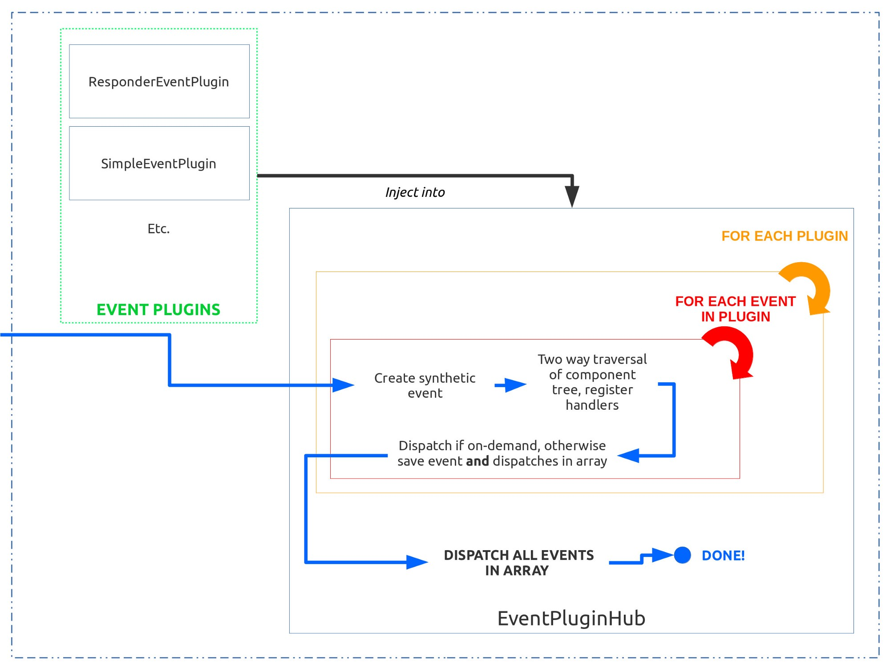
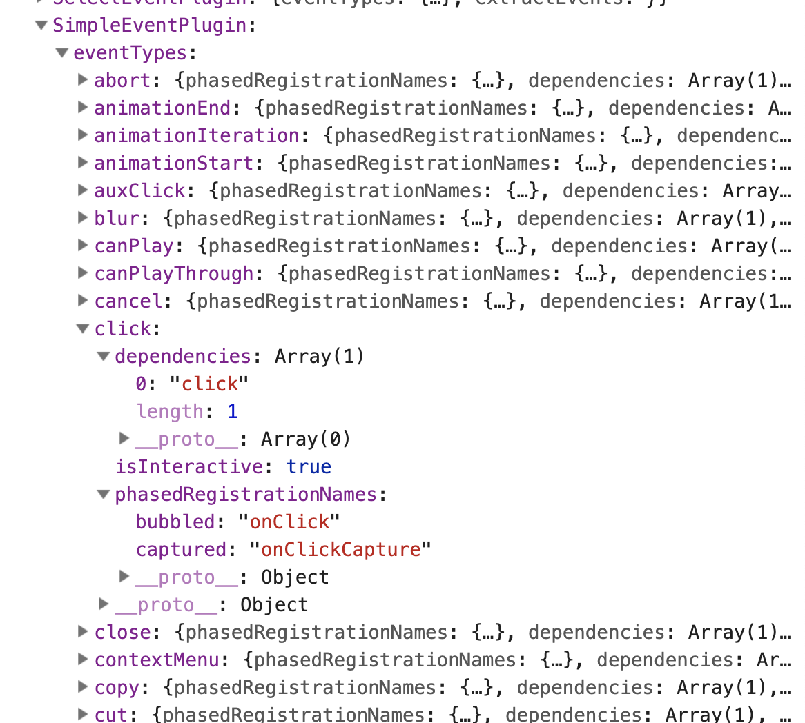

## 合成事件

- 对于React web来说，事件处理使用了顶级代理，React在document这个层级上监听了所有的事件，这意味着当我们在React写的事件回调执行的时候，该事件其实已经经历过了捕获和冒泡阶段，可以说原生事件的执行顺序是早于react事件的。
- 利用事件委托机制把浏览器原生事件都委托到document对象上，减少页面的注册事件数量，减少内存开销，优化浏览器性能，也能更好的统一管理事件。
- 事件处理函数将会接收SyntheticEvent的实例，一个基于浏览器原生事件的跨浏览器实现。它拥有和浏览器原生事件一样的接口，包括stopPropagation()和preventDefault(),注意event.stoppropagation()不能阻止原生冒泡
- React事件处理了兼容性问题，React 定义`topLevelTypes`包装了浏览器特定的事件，比如transitionEnd , webkitTransitionEnd , MozTransitionEnd and oTransitionEnd 都统一为 topAnimationEnd
- SyntheticEvent是共享的。那就意味着在调用事件回调之后，SyntheticEvent对象将会被重用，并且所有属性会被置空
- 合成事件由对应的 EventPlugin负责合成，不同类型的事件由不同的 plugin合成，例如 SimpleEvent Plugin、TapEvent Plugin等
  


#### 事件注入

React 为了跨平台，采用了注入的模式，让不同的平台对事件核心模块进行插件注入。

比如Web环境下


```
import {injection as EventPluginHubInjection} from 'events/EventPluginHub';
import {setComponentTree} from 'events/EventPluginUtils';

import {
  getFiberCurrentPropsFromNode,
  getInstanceFromNode,
  getNodeFromInstance,
} from './ReactDOMComponentTree';
import BeforeInputEventPlugin from '../events/BeforeInputEventPlugin';
import ChangeEventPlugin from '../events/ChangeEventPlugin';
import DOMEventPluginOrder from '../events/DOMEventPluginOrder';
import EnterLeaveEventPlugin from '../events/EnterLeaveEventPlugin';
import SelectEventPlugin from '../events/SelectEventPlugin';
import SimpleEventPlugin from '../events/SimpleEventPlugin';


EventPluginHubInjection.injectEventPluginOrder(DOMEventPluginOrder);
setComponentTree(
  getFiberCurrentPropsFromNode,
  getInstanceFromNode,
  getNodeFromInstance,
);

EventPluginHubInjection.injectEventPluginsByName({
  SimpleEventPlugin: SimpleEventPlugin,
  EnterLeaveEventPlugin: EnterLeaveEventPlugin,
  ChangeEventPlugin: ChangeEventPlugin,
  SelectEventPlugin: SelectEventPlugin,
  BeforeInputEventPlugin: BeforeInputEventPlugin,
});
```

通过这两个方法向事件系统注入了平台相关的事件代码，同时确定事件的调用顺序。

#### 事件系统流程




*** EventPluginHub *** 是整个事件系统的基石

-  为每个需要注入的插件提供了统一的接口
-  每次收到新的原生事件时都会通过注入的插件，在调用之前收集生成合成事件


#### Event plugins


React有很多事件的插件，比如`SimpleEventPlugin` 可以处理click等事件，所有的插件都遵循相同的模式

- extractEvents 这个是每个插件必须实现的方法，根据具体真实触发的事件类型等参数返回对应的事件对象
- eventTypes是以具体事件为key的 map 对象，其中每个事件的phasedRegistrationNames是指定props的名字,一般分为bubble和capture两个属性，代表冒泡和捕获。
- executeDispatch 是一个函数，允许插件覆盖事件的调度方式，默认情况下，只调用listener





#### 插件注册


注册插件相关的变量含义
- eventPluginOrder 插件注册的顺序   
- plugins 按照eventPluginOrder顺序存储的插件模块数组
- namesToPlugins 以插件名为key的插件 map
- registrationNameModules 存储有phasedRegistrationNames或者registrationName的插件的事件对应的模块
- registrationNameDependencies 存储以事件名为key对应的事件的dependencies
- eventNameDispatchConfigs 按照每个插件中的eventTypes中的每一项为key，其对应的键值为value的对象
- possibleRegistrationNames 小写的事件名对应大写的事件名。如``` onclick: "onClick" ```


#### 变量的具体结构

- eventPluginOrder

```
['ResponderEventPlugin', 'SimpleEventPlugin', 'EnterLeaveEventPlugin', 'ChangeEventPlugin', 'SelectEventPlugin', 'BeforeInputEventPlugin'];
```

- plugins
  
```
[
    {
        eventTypes:{},
        extractEvents:function,
        otherProps
    },
    ....
]
```

- namesToPlugins

```
{
    SimpleEventPlugin:{
        eventTypes:{},
        extractEvents:function,
        otherProps
    },
    ...其他插件
}
```

- registrationNameModules

```
{
    onClick:{
        eventTypes:{},
        extractEvents:function,
        otherProps
    },
    ...
}
```
- registrationNameDependencies


```
{
    onClick: ["click"],
    onChange: [
        "blur", "change", "click", "focus", "input", "keydown",keyup", "selectionchange
        ],
    ....
}

```
- eventNameDispatchConfigs

```
{
    click:{
        dependencies:['click'],
        phasedRegistrationNames:{
            bubbled: "onClick"
            captured: "onClickCapture"
        },
        isInteractive: true
    }
}
```

整个注册过程就是为了初始化设置这些变量,在后续的事件处理中使用。


##### 注册的方法调用顺序

1. 调用injectEventPluginOrder，设置eventPluginOrder
2. 调用injectEventPluginsByName ，所有插件加入到namesToPlugins对象中
3. 调用recomputePluginOrdering，把所有插件按顺序插入到plugins数组中，并遍历每个插件的eventTypes，调用publishEventForPlugin，设置eventNameDispatchConfigs这个对象，以事件名为key存储dispatchConfig对象，如果dispatchConfig存在phasedRegistrationNames属性就遍历该对象执行publishRegistrationName方法设置registrationNameModules，registrationNameDependencies和possibleRegistrationNames
