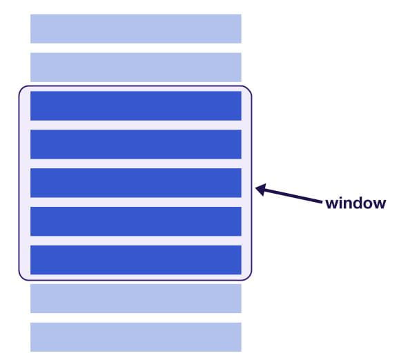

<!--
 * @Description: In User Settings Edit
 * @Author: your name
 * @Date: 2019-08-19 10:17:09
 * @LastEditTime: 2019-08-19 14:53:09
 * @LastEditors: Please set LastEditors
 -->
## 窗口化技术

有时候我们会展示非常大的列表或者表格，这些列表或者表格会包含很多行，加载全部的数据会导致显著的性能问题。

列表虚拟化或者窗口化技术是只渲染用户看到的部分，每次只渲染大列表中的一小部分，这种技术极大的提高了渲染性能。

当用户滚动的时候，窗口之外的DOM节点会被回收或者被新的节点取代，保证了只渲染窗口内特定个数的elements。

- window 滚动容器的可视区域，如果是浏览器的window，就是浏览器的视口大小，如果是其他容器，比如div ，其高度是300px,那么视口大小就是300px
- 滚动区域 假设有10000条数据，每项高度30px,那么可滚动区域就是10000*30，可以通过scrollHeight获得滚动区域，通过scrollTop获得滚动偏移量

