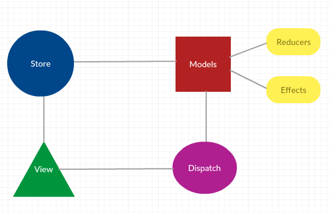

<!--
 * @Description: In User Settings Edit
 * @Author: your name
 * @Date: 2019-08-13 23:13:53
 * @LastEditTime: 2019-08-14 01:47:11
 * @LastEditors: Please set LastEditors
 -->
## rematch

Redux作为一个状态管理库，截止目前超过78万次使用，5万多star。其代码非常的简洁，俗称'百行代码，千行注释'。集中式的管理应用的状态和修改状态的方法对于大型复杂应用是正确的思想，但是其使用过程中充斥着大量的模板代码，比如actionType,actionCreator,reducer这些经常被人诟病。在社区有很多库致力于减少这种模板代码，有的是改写了Redux,有的是基于Redux进行封装，简化其使用。

#### 类Redux的库
- redux-zero
- Repatch
  
#### Redux增强
- Rematch
- Reduxigen

这些改写Redux的库虽然简化了Redux的使用，但是导致Redux很多功能无法使用，比如Redux-devtool，中间件功能等。而基于Redux进行增强的库不仅简化了Redux的使用，还保留了Redux的特性和功能。其中Rematch 是比较流行的，在设计上非常优秀的一个。





*** model 是 Rematch的核心概念 *** 它是一个对象，属性如下：

- State 全局状态对象
- Reducers 处理状态变更的纯函数
- Effects  处理副作用,并不直接处理状态的变更


其使用方法:

```
https://rematch.gitbooks.io/rematch/#getting-started
```

```
import { init, dispatch } from "@rematch/core";
import delay from "./makeMeWait";

const count = {
  state: 0,
  reducers: {
    increment: (state, payload) => state + payload,
    decrement: (state, payload) => state - payload
  },
  effects: dispatch => ({
        async incrementAsync() {
            await delay(500)
            dispatch.dolphins.increment()
        },
    }),
};

const store = init({
  models: { count }
});

dispatch.count.incrementAsync(1);
```

## Rematch 设计思想

Rematch 的出发点就是简化使用方式。

#### 简化了初始化

在Redux中，如果初始化一般是像这样

```
const configureStore = preloadedState => {
  const store = createStore(
    rootReducer,
    preloadedState,
    compose(
      applyMiddleware(thunk, api, createLogger()),
      DevTools.instrument()
    )
  )
  return store
}
```

Rematch简化为

```
const store = init({
  models: { count }
});
```

#### 简化actionCreator和Reducer 

Rematch 中将model的name和reducer的方法名结合生成actionType,而每个方法对应以前switch函数的一个case。


```
reducers: {
    increment: (state, payload) => state + payload,
    decrement: (state, payload) => state - payload
  },
```

#### 自动加入async await

对于副作用的处理使用async await更加友好。
```
effects: dispatch => ({
    async incrementAsync() {
        await delay(500)
        dispatch.dolphins.increment()
    },
}),
```


#### 问题

- Rematch 是如何减少模板代码的，即如何自动生成actionType的？
- 既然没有改写Redux，那么Rematch 如何和Redux结合的？
- Rematch 如何处理异步action？


#### Rematch 源码

源码结构
```

├── plugins
|   ├── dispatch.ts dispatchPlugin主要是暴露dispatch方法和处理reducer
|   ├── effects.ts effectsPlugin 主要是处理副作用和添加异步middleware
|—— utils   //  工具函数 
├── index.ts    //  入口文件      
├── pluginFactory.ts  //插件工厂，用于抽取插件中的方法
├── redux.ts    //  将rematch的属性进行处理传给redux生成store
├── rematch.ts  //  Rematch类

```

#### index.ts

```
export const init = (initConfig: R.InitConfig = {}): R.RematchStore => {
	const name = initConfig.name || count.toString()
	count += 1
	const config: R.Config = mergeConfig({ ...initConfig, name })
	return new Rematch(config).init()
}

export default {
	init,
}
```
- 初始化store的name
- 将name合并到配置参数中
- 实例化Rematch并调用其init方法进行初始化

#### Rematch.ts

默认的核心插件
```
const corePlugins: R.Plugin[] = [dispatchPlugin, effectsPlugin]

```

Rematch 类
```
export default class Rematch {
	protected config: R.Config
	protected models: R.Model[]
	private plugins: R.Plugin[] = []
	private pluginFactory: R.PluginFactory

	constructor(config: R.Config) {
        //init方法传入的config ，config中主要是我们传入的model
		this.config = config
        //插件工厂，用于收集各插件的方法
		this.pluginFactory = pluginFactory(config)
		for (const plugin of corePlugins.concat(this.config.plugins)) {
			this.plugins.push(this.pluginFactory.create(plugin))
		}
		// preStore: middleware, model hooks
		this.forEachPlugin('middleware', (middleware) => {
			this.config.redux.middlewares.push(middleware)
		})
	}
	public forEachPlugin(method: string, fn: (content: any) => void) {
		for (const plugin of this.plugins) {
			if (plugin[method]) {
				fn(plugin[method])
			}
		}
	}
	public getModels(models: R.Models): R.Model[] {
		return Object.keys(models).map((name: string) => ({
			name,
			...models[name],
			reducers: models[name].reducers || {},
		}))
	}
	public addModel(model: R.Model) {
		validate([
			[!model, 'model config is required'],
			[typeof model.name !== 'string', 'model "name" [string] is required'],
			[model.state === undefined && model.baseReducer === undefined, 'model "state" is required'],
			[model.baseReducer !== undefined &&
				typeof model.baseReducer !== 'function', 'model "baseReducer" must be a function'
			],
		])
		// run plugin model subscriptions
		this.forEachPlugin('onModel', (onModel) => onModel(model))
	}
	public init() {
		// collect all models
		this.models = this.getModels(this.config.models)
		for (const model of this.models) {
			this.addModel(model)
		}
		// create a redux store with initialState
		// merge in additional extra reducers
		const redux = createRedux.call(this, {
			redux: this.config.redux,
			models: this.models,
		})

		const rematchStore = {
			name: this.config.name,
			...redux.store,
			// dynamic loading of models with `replaceReducer`
			model: (model: R.Model) => {
				this.addModel(model)
				redux.mergeReducers(redux.createModelReducer(model))
				redux.store.replaceReducer(redux.createRootReducer(this.config.redux.rootReducers))
				redux.store.dispatch({ type: '@@redux/REPLACE '})
			},
		}

		this.forEachPlugin('onStoreCreated', (onStoreCreated) => {
			const returned = onStoreCreated(rematchStore)
			// if onStoreCreated returns an object value
			// merge its returned value onto the store
			if (returned) {
				Object.keys(returned || {}).forEach((key) => {
					rematchStore[key] = returned[key]
				})
			}
		})

		return rematchStore
	}
}
```


### constructor

1. 调用pluginFactory(config) 返回一个对象
   - config
   - validate
   - create方法

2. 遍历corePlugins ，收集插件的方法。

```
this.pluginFactory = pluginFactory(config)
for (const plugin of corePlugins.concat(this.config.plugins)) {
    this.plugins.push(this.pluginFactory.create(plugin))
}
//将插件中的middleware放入redux中，方便创建store的时候使用
this.forEachPlugin('middleware', (middleware) => {
    this.config.redux.middlewares.push(middleware)
})
```

值得一提就是create方法

```
create(plugin){
    if (plugin.onInit) {
			plugin.onInit.call(this)
		}

    const result: R.Plugin | any = {}

    if (plugin.exposed) {
        //将插件暴露出来的方法bind到this.pluginFactory
        for (const key of Object.keys(plugin.exposed)) {
            this[key] =
                typeof plugin.exposed[key] === 'function'
                    ? plugin.exposed[key].bind(this) // bind functions to plugin class
                    : Object.create(plugin.exposed[key]) // add exposed to plugin class
        }
    }
    //将插件中的 'onModel', 'middleware', 'onStoreCreated'的方法生成一个对象，该对象将保存 Rematch的plugins中。同时bind这些方法到this.pluginFactory
    for (const method of ['onModel', 'middleware', 'onStoreCreated']) {
        if (plugin[method]) {
            result[method] = plugin[method].bind(this)
        }
    }
    return result
}
```

#### dispatchPlugin, effectsPlugin 两大插件的方法

###### dispatchPlugin
  ```
  exposed:{
      storeDispatch,
      storeGetState,
      dispatch,
      createDispatcher,
  },
  onStoreCreated,
  onModel
  ```

###### effectsPlugin
  ```
  exposed:{
      effects:{},
  },
  onModel,
  middleware
  ```
经过构造器的初始化最终plugins和pluginFactory的属性如下

pluginFactory

```
config
storeDispatch,
storeGetState,
dispatch,
createDispatcher,
effects
```

plugins

```
[
    {onModel,onStoreCreated},
    {onModel,middleware},
]
```


### init方法


- 收集所有的model


```
this.models = this.getModels(this.config.models)
public getModels(models: R.Models): R.Model[] {
    return Object.keys(models).map((name: string) => ({
        name,
        ...models[name],
        reducers: models[name].reducers || {},
    }))
}

```

- 遍历model，调用addModel方法

这一步核心是遍历每一个model,然后将model传入每一个插件的onModel方法

这两个插件的onModel方法分别会对model中的reducer和effects进行处理

```

for (const model of this.models) {
        this.addModel(model)
}
// addModel 核心逻辑
this.forEachPlugin('onModel', (onModel) => onModel(model))
```

##### dispatch 插件的onModel方法

在dispatch 方法上绑定模块对应的reducer方法，所以我们可以像`dispatch.count.increment(payload)`这样调用。


```
onModel(model: R.Model) {
    this.dispatch[model.name] = {}
    if (!model.reducers) {
        return
    }
    for (const reducerName of Object.keys(model.reducers)) {
        this.dispatch[model.name][reducerName] = this.createDispatcher.apply(
            this,
            [model.name, reducerName]
        )
    }
}
// createDispatcher 返回的函数是一个标准的actionCreator
// 根据modelName和reducerName 动态生成actionType
createDispatcher(modelName: string, reducerName: string) {
    return async (payload?: any, meta?: any): Promise<any> => {
        const action: R.Action = { type: `${modelName}/${reducerName}` }
        if (typeof payload !== 'undefined') {
            action.payload = payload
        }
        if (typeof meta !== 'undefined') {
            action.meta = meta
        }
        return this.dispatch(action)
    }
}
```

##### effects 插件的onModel方法

绑定effect方法到dispatch

```
onModel(model: R.Model): void {
    if (!model.effects) {
        return
    }
    //给effects方法传入dispatch ，这个dispatch是增强版的dispatch，绑定这不同model上的reducer和effect方法，在effect的方法里可以直接使用。
    const effects =
        typeof model.effects === 'function'
            ? model.effects(this.dispatch)
            : model.effects

    for (const effectName of Object.keys(effects)) {
        this.effects[`${model.name}/${effectName}`] = effects[effectName].bind(
            this.dispatch[model.name]
        )
        //添加effect dispatch
        this.dispatch[model.name][effectName] = this.createDispatcher.apply(
            this,
            [model.name, effectName]
        )
        //加个effect标记
        this.dispatch[model.name][effectName].isEffect = true
    }
}
```

- 创建redux store

```
const redux = createRedux.call(this, {
    redux: this.config.redux,
    models: this.models,
})

// createRedux 方法
export default function({
	redux,
	models,
}: {
	redux: R.ConfigRedux,
	models: R.Model[],
}) {
    // redux的combineReducers
	const combineReducers = redux.combineReducers || Redux.combineReducers
    // redux的createStore
	const createStore: Redux.StoreCreator = redux.createStore || Redux.createStore
    //初始状态
	const initialState: any =
		typeof redux.initialState !== 'undefined' ? redux.initialState : {}
    // r
	this.reducers = redux.reducers

	// 合并reducer
	this.mergeReducers = (nextReducers: R.ModelReducers = {}) => {
		// merge new reducers with existing reducers
		this.reducers = { ...this.reducers, ...nextReducers }
		if (!Object.keys(this.reducers).length) {
			// no reducers, just return state
			return (state: any) => state
		}
        //将最终的reducer传入redux原始的combineReducers中
		return combineReducers(this.reducers)
	}
    // 根据model创建对应的reducer
	this.createModelReducer = (model: R.Model) => {
		const modelBaseReducer = model.baseReducer;
        // 由于闭包的关系，modelReducers将一直存在，并将在 combinedReducer被使用
        //每次dispatch action 会调用所有的reducer（combinedReducer），在这里会对比找到对应的处理方法
		const modelReducers = {}
        //遍历每个model的reducer
		for (const modelReducer of Object.keys(model.reducers || {})) {
            // 生成actionType
			const action = isListener(modelReducer)
				? modelReducer
				: `${model.name}/${modelReducer}`;
            //将type 和对应的 reducer方法存入 modelReducers
			modelReducers[action] = model.reducers[modelReducer]
		}
        // 一个modle 对应一个 combinedReducer
        // state 的默认值是model.state
        // 这里是不是很像reducer? 目的就是讲rematch的数据转化成标准的redux风格
		const combinedReducer = (state: any = model.state, action: R.Action) => {
			// 如果actionType匹配就调用对应的方法，类似switch 中的case
			if (typeof modelReducers[action.type] === 'function') {
				return modelReducers[action.type](state, action.payload, action.meta)
			}
            //不匹配就返回之前的state
			return state
		}

		this.reducers[model.name] = !modelBaseReducer
			? combinedReducer
			: (state: any, action: R.Action) =>
					combinedReducer(modelBaseReducer(state, action), action)
	}
	// 遍历model，将reducer进行统一处理成参数符合redux的reducer
	for (const model of models) {
		this.createModelReducer(model)
	}

	this.createRootReducer = (
		rootReducers: R.RootReducers = {}
	): Redux.Reducer<any, R.Action> => {
		const mergedReducers: Redux.Reducer<any> = this.mergeReducers();
        //如果有存在rootReducers，就先执行rootReducers，然后将其结果作为redux 的combineReducers 的state
		if (Object.keys(rootReducers).length) {
			return (state, action) => {
				const rootReducerAction = rootReducers[action.type]
				if (rootReducers[action.type]) {
					return mergedReducers(rootReducerAction(state, action), action)
				}
                // 这里其实调用的是 redux 的combineReducers 
				return mergedReducers(state, action)
			}
		}
		return mergedReducers
	}
    // 创建rootReducer
	const rootReducer = this.createRootReducer(redux.rootReducers)

	const middlewares = Redux.applyMiddleware(...redux.middlewares)
	const enhancers = composeEnhancersWithDevtools(redux.devtoolOptions)(
		...redux.enhancers,
		middlewares
	)
    // 创建store
	this.store = createStore(rootReducer, initialState, enhancers)

	return this
}
```

总结一下：

1. 遍历model 将其reducer处理成符合redux的reducer签名一样的函数
2. 使用redux的combineReducers对reducer进行合并处理
3. 创建redux store


#### 中间件

由于中间件的机制，每一个action都会经过该middleware。

不是effect就直接执行dispatch(action),否则进行异步任务处理

```
middleware(store: any) {
    return next => async (action: R.Action) => {
        // async/await acts as promise middleware
        if (action.type in this.effects) {
            await next(action)
            return this.effects[action.type](
                action.payload,
                store.getState(),
                action.meta
            )
        }
        return next(action)
    }
}
```

#### Rematch

- 插件的模式，插件有统一的接口，通过工厂方法对插件进行处理，扩展性强，低耦合
- 保留redux的功能，方便集成第三方插件
- 消除了actionType，根据model name和reducer 自动生成actionCreator和reducer
  

  
